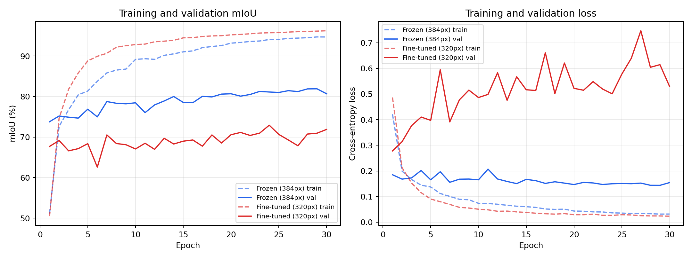

# DINOv3 ViT-S/16 + PSPNet 在 PASCAL VOC2012 上的语义分割实验报告

## 摘要

本实验使用预训练 DINOv3 ViT-S/16 作为视觉骨干，将 patch token 重排为二维特征图，随后接入
PSPNet 的 Pyramid Pooling Module（PPM）完成 PASCAL VOC2012 的 21 类语义分割。实验比较了
冻结 DINOv3 与全量微调 DINOv3 两种方案。当前最佳验证结果为冻结方案的 **81.90% mIoU** 和
**96.05% 像素准确率**；微调方案为 **72.93% mIoU** 和 **92.38% 像素准确率**。冻结方案高出
8.98 个 mIoU 百分点，并在全部 21 个类别上取得更高 IoU。训练曲线表明微调方案存在明显过拟合。
不过，两组输入尺寸和 batch size 不同，当前比较不是严格的单变量消融实验，结果不能全部归因于
是否解冻骨干。

## 1. 实验目标

实验验证 DINOv3 的预训练密集视觉特征能否迁移到 VOC2012 语义分割任务，并分析 PSPNet 分割头
在冻结和微调骨干两种设置下的性能。模型数据流如下：

```text
输入 [B,3,H,W]
  → DINOv3 ViT-S/16
  → patch tokens [B,(H/16)(W/16),384]
  → 二维特征 [B,384,H/16,W/16]
  → PSPNet PPM（1×1、2×2、3×3、6×6）
  → 21 类 logits
  → 双线性上采样至 [B,21,H,W]
```

训练使用逐像素交叉熵，VOC 标注中的 255 作为忽略标签。评价时先累积完整验证集混淆矩阵，
再计算每类 IoU 及其宏平均 mIoU。

## 2. 实验设置

两组共同设置为：VOC2012 官方 train/val 划分、训练 30 epoch、随机种子 42、AdamW、head 学习率
1e-3、权重衰减 1e-4、自动混合精度，以及同一份 DINOv3 ViT-S/16 LVD-1689M 预训练权重。

| 设置 | Frozen | Fine-tuned |
|---|---:|---:|
| DINOv3 是否训练 | 否 | 是 |
| 输入尺寸 | 384×384 | 320×320 |
| Batch size | 2 | 1 |
| Head LR | 1e-3 | 1e-3 |
| Backbone LR | 0 | 1e-5 |
| Epoch | 30 | 30 |
| 最佳 checkpoint epoch | 29 | 24 |

由于显存条件导致输入尺寸和 batch size 不同，本表是“实际运行方案比较”，不是严格控制变量实验。

## 3. 总体结果

| 模型 | Val loss | Pixel accuracy | mIoU | 相对冻结组 mIoU |
|---|---:|---:|---:|---:|
| Frozen DINOv3-S + PSPNet | **0.1438** | **96.05%** | **81.90%** | — |
| Fine-tuned DINOv3-S + PSPNet | 0.5007 | 92.38% | 72.93% | -8.98 pp |

冻结方案同时获得更低的 loss、更高的像素准确率和更高的 mIoU，因此是本次实验的最佳方案。
微调方案的 mIoU 相对冻结方案下降约 10.96%（相对比例），绝对下降 8.98 个百分点。



冻结组验证 mIoU 从第 1 轮的 73.79% 上升到第 29 轮最佳值 81.90%，第 30 轮略回落至
80.69%。微调组第 1 轮验证 mIoU 为 67.69%，第 24 轮达到最佳 72.93%，第 30 轮为 71.89%。
保存最佳 checkpoint 而非直接使用最后一轮是正确的。

## 4. 逐类别 IoU

| 类别 | Frozen | Fine-tuned | Fine-tuned − Frozen |
|---|---:|---:|---:|
| background | 95.56% | 91.18% | -4.37 pp |
| aeroplane | 88.48% | 84.31% | -4.17 pp |
| bicycle | 55.98% | 50.86% | -5.12 pp |
| bird | 90.80% | 82.99% | -7.81 pp |
| boat | 79.47% | 73.47% | -6.00 pp |
| bottle | 82.28% | 80.80% | -1.47 pp |
| bus | 93.47% | 82.25% | -11.22 pp |
| car | 86.91% | 76.23% | -10.68 pp |
| cat | 93.85% | 70.47% | -23.38 pp |
| chair | 51.44% | 44.06% | -7.38 pp |
| cow | 89.68% | 79.60% | -10.08 pp |
| diningtable | 71.64% | 68.72% | -2.91 pp |
| dog | 92.80% | 81.58% | -11.22 pp |
| horse | 83.88% | 72.31% | -11.57 pp |
| motorbike | 84.26% | 78.61% | -5.65 pp |
| person | 90.69% | 79.44% | -11.25 pp |
| pottedplant | 65.82% | 49.76% | -16.06 pp |
| sheep | 88.51% | 72.52% | -15.99 pp |
| sofa | 66.35% | 53.74% | -12.61 pp |
| train | 90.31% | 80.94% | -9.37 pp |
| tvmonitor | 77.83% | 77.62% | -0.21 pp |

冻结组表现最好的前景类别是 cat（93.85%）、bus（93.47%）和 dog（92.80%）；较弱类别是
chair（51.44%）、bicycle（55.98%）和 pottedplant（65.82%）。这些类别往往具有细结构、遮挡、
尺度小或与室内背景混淆等特点，而 ViT-S/16 的 16 像素 patch 步长会进一步限制细边界恢复。
微调的最大跌幅出现在 cat（-23.38 pp）、pottedplant（-16.06 pp）和 sheep（-15.99 pp）。

## 5. 过拟合分析

冻结组最佳 epoch 的训练/验证 mIoU 分别为 94.70%/81.90%，泛化间隙约 12.80 pp；训练/验证
loss 分别为 0.0316/0.1438。它也存在一定过拟合，但验证性能总体随训练推进而改善。

微调组最佳 epoch 的训练/验证 mIoU 分别为 95.73%/72.93%，泛化间隙扩大到约 22.46 pp；
训练 loss 仅 0.0266，验证 loss 却达到 0.5007。到第 30 轮，训练 mIoU 继续升至 96.22%，验证
mIoU 仅为 71.89%。这说明模型并非优化失败，而是对仅 1,464 张训练图像拟合过强，预训练表示
在全量解冻后发生了不利的任务适配或表示漂移。

可能原因包括：VOC2012 官方训练集较小；全量微调 21M 参数的自由度过高；数据增强只有缩放与
水平翻转；320 输入比冻结组的 384 输入少约 30.6% 的像素，也减少了小目标和边界信息；batch 1
会令 PSP head 中 BatchNorm 的统计量更不稳定。因此当前结果支持“冻结更稳健”，但尚不能独立
证明“微调本身必然降低性能”。

## 6. 结论

本实验成功实现了 DINOv3 ViT-S/16 与 PSPNet 的迁移学习语义分割系统。冻结 DINOv3 时，仅训练
PSPNet 头即可在 VOC2012 val 上达到 81.90% mIoU，说明 DINOv3 的预训练 patch 特征具有很强的
密集预测迁移能力。在当前资源和配置下，全量微调不仅没有提升结果，反而产生明显过拟合，最佳
mIoU 低 8.98 个百分点。因此，本次实验最终推荐 **Frozen DINOv3-S + PSPNet**。

## 7. 有效性限制与后续实验

1. 两组应在相同的 384×384 输入和相同 batch size（可用梯度累积模拟）下重跑，形成严格消融。
2. 微调可改为只解冻最后 2–4 个 Transformer block，而不是全量解冻。
3. 可将 backbone LR 从 1e-5 降至 1e-6，并采用 warm-up、layer-wise learning-rate decay。
4. 增加随机尺度、随机裁剪、颜色扰动等增强，并更早 early stopping。
5. batch 1 时可冻结 head 的 BatchNorm 统计量或改用 GroupNorm。
6. 当前结果来自反复用于选最佳 checkpoint 的 val 集，应称为验证结果；若需要无偏最终成绩，
   应另设测试集或提交 VOC 官方 test server。

## 8. 可复现依据

- 原始总体指标：`outputs/frozen/evaluation.json`、`outputs/finetuned/evaluation.json`
- 完整训练记录：`outputs/frozen/history.json`、`outputs/finetuned/history.json`
- 最佳模型：冻结组 epoch 29，微调组 epoch 24
- 曲线生成：运行 `python analyze_results.py`

